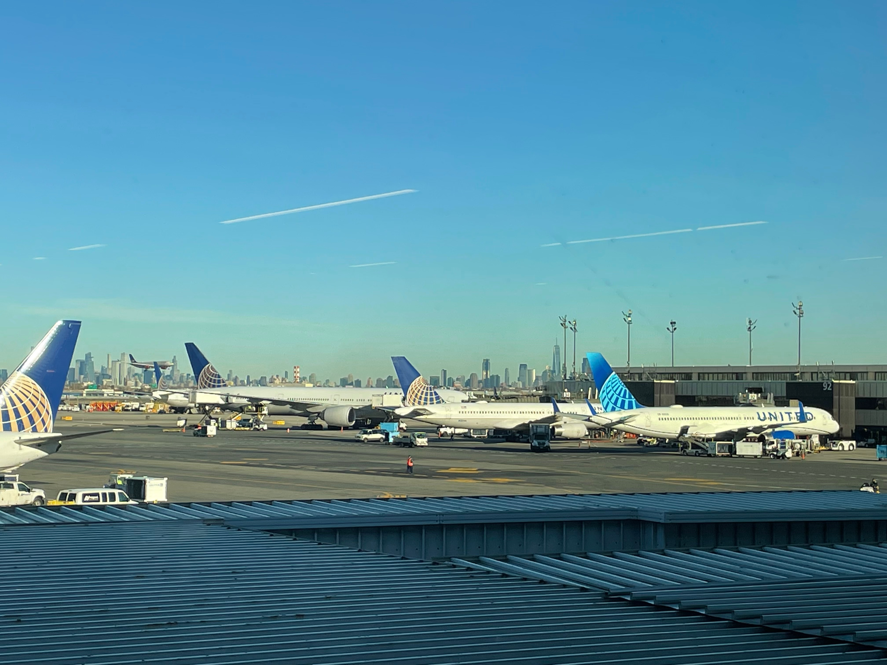

# SDD 2022 Conference Day 0

## What is it?
Amazon Web Services (AWS) [re:Invent](https://reinvent.awsevents.com/?trk=8ea681d5-b27f-42ad-8977-1a9478743157&sc_channel=el) is a learning conference hosted by AWS for the global cloud computing community.

Is one of the biggest tech events in the world spreads across a “campus” that is six event venues lining the famous Las Vegas Strip! The venues hosting events include:

- The Encore
- Wynn
- The Venetian & Palazzo
- Caesars Forum
- MGM Grand
- Mandalay Bay

Here in Do iT Lean we have been using some AWS technologies but attending this event is the best opportunity to get hands-on access and learn from AWS experts to improve our knowledge.

Learnling and including those concepts into Outsystems world, I think is the "next step" developing with Oustsystems.

----

## Getting here

I had to take two flights to be in Las Vegas so it took me one day just for traveling. 

I departed from Lisboa to Newark to take the flight to Las Vegasa and the best thing arring here was to see Manhattan by the window and meet four portugueses that will be also attending the event.

They are DevOps so we talked a little bit about the event and what they are expecting to see. I hope to see them again.

In the flight to Las Vegas was funny to watch a speaker finishing his slides for the AWS event, to talk about using open data on AWS for healthcare and life sciences. I got spoiled :)

Soon as I arrive in Vegas the first thing I saw after left the plane was some slot machines! I was not expecting to see it in the airport but this is Vegas :D

Taking a taxi to the hotel I could understand the people in Vegas are exceting with the World Cup soon as I said I am Portuguese they said "Siii" "Ronaldo" "Portugal is the best Team", and we talked a little about soccer. 
I was not expecting to talk with americans about soccer but they say is a World Cup every body is exciting about it.

----
