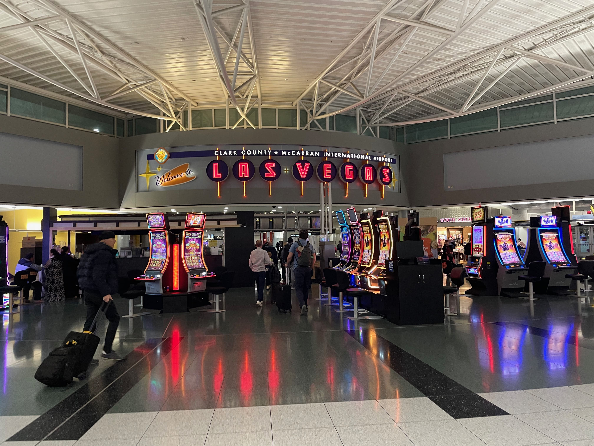

# AWS re:Invent 2022 | Day 0

## What is it?
Amazon Web Services (AWS) [re:Invent](https://reinvent.awsevents.com/?trk=8ea681d5-b27f-42ad-8977-1a9478743157&sc_channel=el) is a learning conference hosted by AWS for the global cloud computing community.

It is one of the biggest tech events in the world spread across a “campus” that is six event venues lining the famous Las Vegas Strip! The venues hosting events include:

- The Encore
- Wynn
- The Venetian & Palazzo
- Caesars Forum
- MGM Grand
- Mandalay Bay

Here in Do iT Lean we have been using some AWS technologies but attending this event is the best opportunity to get hands-on access and learn from AWS experts to improve our knowledge.

Learning and incorporating those concepts into Outsystems world, I think is the "next step" in terms of developing Outsystems.

----

## Getting here

I had to take two flights to be in Las Vegas so it took me one day just to travel there.

I flew from Lisbon to Newark to take the flight to Las Vegas and the best thing on the flight was to see Manhattan from the window and meet four Portuguese guys that will also be attending the event.

They are DevOps, so we talked a little bit about the event and what they are expecting to see. I hope to see them again.

On the flight to Las Vegas it was funny to watch a speaker finishing his slides for the AWS event - talking about using open data on AWS for healthcare and life sciences. I got spoiled :)

As soon as I arrived in Vegas the first thing I saw after leaving the plane was some slot machines! I was not expecting to see it in the airport, but this is Vegas :D

Taking a taxi to the hotel I soon understood that the people in Vegas are excited aboout the World Cup. As soon as I said “I am Portuguese.” they said "Siii" "Ronaldo" "Portugal is the best Team", and we talked a little about soccer.
I was not expecting to talk with Americans about soccer but they say it is a World Cup and everybody is excited about it.

----
