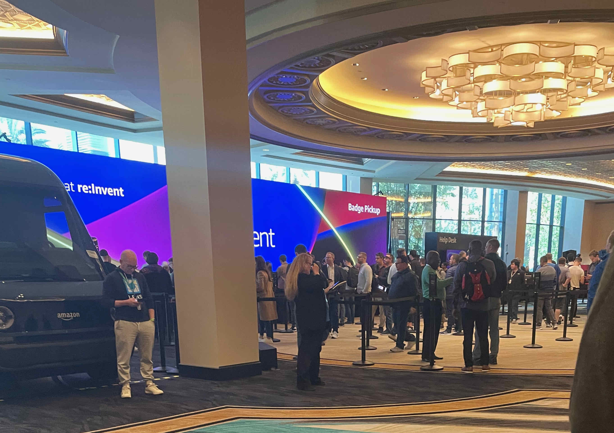
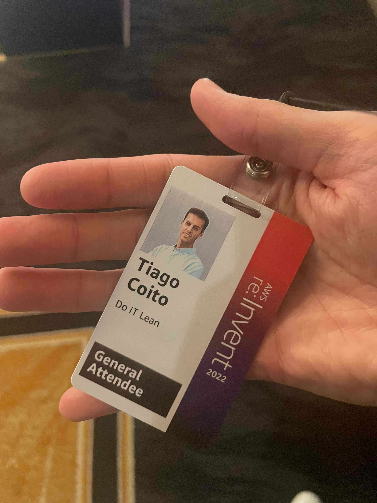
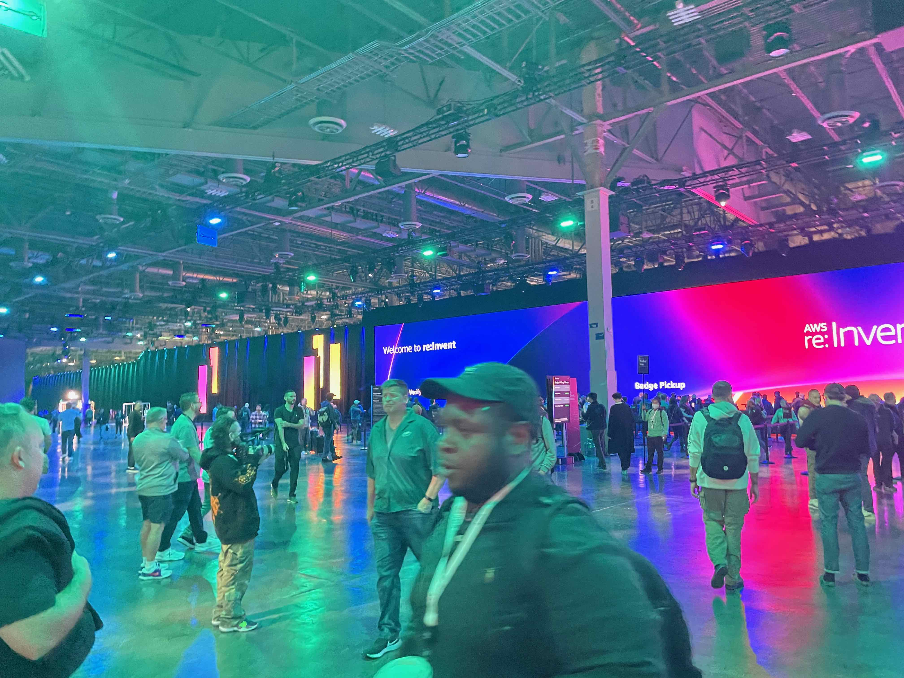
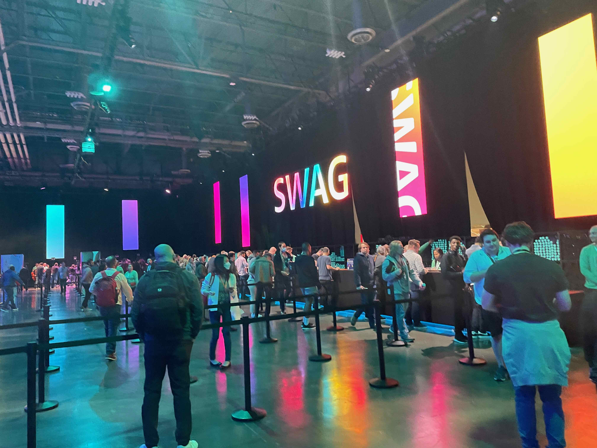
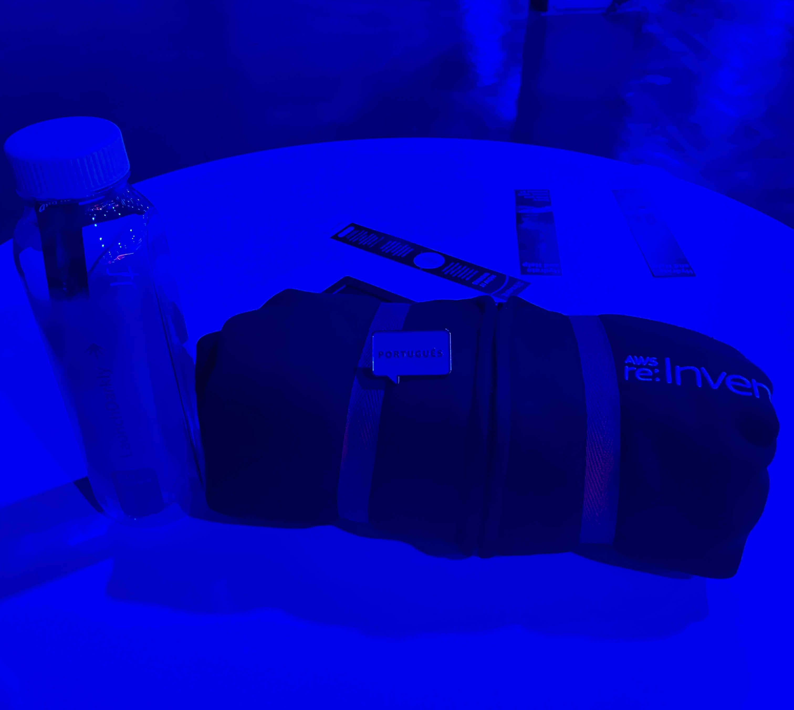
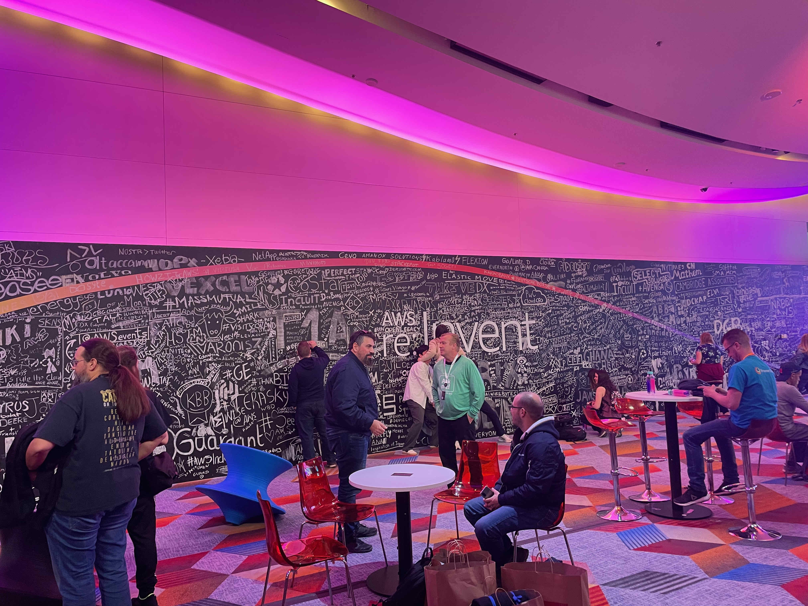
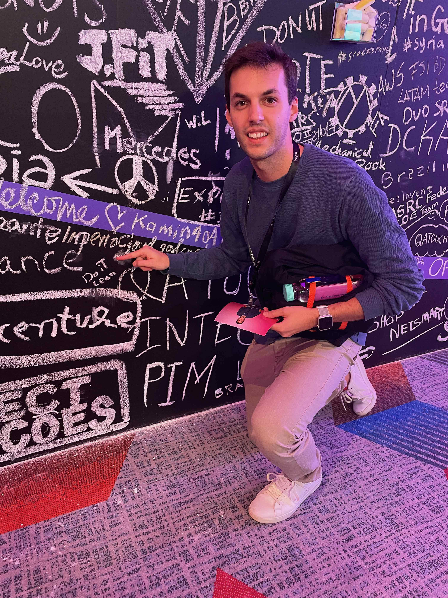

# AWS re:Invent 2022 | Day 1 - Sunday, Nov. 27

## Badge pickup

Today I woke up everly 5 am, I am still jet lagged :) so I used this time to take a look into [map](https://reinvent.awsevents.com/campus/?trk=direct#map) and see what I have around. Lucky for me I am at the Flamingo Hotel, that is at the center of the Strip, I can see many things [around](https://reinvent.awsevents.com/campus/?trk=direct#venue).

The badge pickup started at 12:00 am at MGM or Venetian, but I was so close to the Venetian that I decided to go by walk to MGM.

Until there, walking in the strip, I was like a child trying to see everything and taking pictures everywhere.
I don't know how many casinos I went through but that explain that in every corner we have a casino.
I think most of them that I went through was by mistake :D 

Arriving at the MGM I didn't expect to walk that far to be at the conference center, I think I walked 15min, the MGM is so big! (I just realized that everything is so big that I think I will use this word a lot)

Entering the conference center I could understand this event is very well organized and has a lot of security (including dogs) and many volunteers.

The line was so big that I couldn't see the end. After three courners I was there.

20 min later I got my badge! yeahh!!

----

## SWAG pickup

I decided to go to the hotels where we will have the sessions to understand how to get there, so at The Mandalay Bay, which is the farthest hotel, I took a shuttle to the Venetian to pickup the Swag and while I was there I had the opportunity to meet some people. 

So I meet a guy that is an electrical engineering in the government healthcare. So he is responsable to have a good infrastrure behind. We talked about the architecture and which kind of services he used from AWS.

He needs to collect all the patient data like name, address, patient history, phone number, ... in the whole network, more than 100 terabytes of data.
So his architecture is based on event drive using kafka and elasticsearch and he uses Amazon S3 and Amazon DynamoDB. 

Each form that is filled he sent an event to the kafka and then goes to elastic on DynamoDB. He mention that is important to have a good index but DynamoDB works very well and when we wants to do some reports for few terabyres is less than 1min!!

Arriving in Venetian I went through the "main" conference center where most of the keynotes will hapeen to pickup the SWAG. 

We had a place to check our size and then other space to pickup. 

here it is!

Outside of this arena there were few entertaining spots, including a big black board where anyone could leave their message or word.

Of course I had to write something...

----
