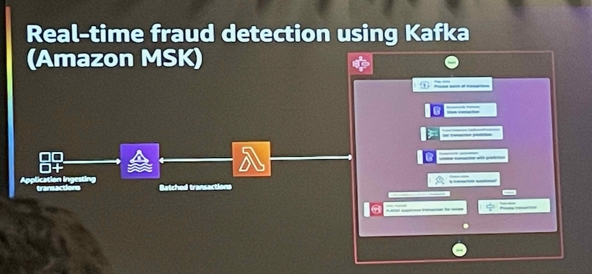
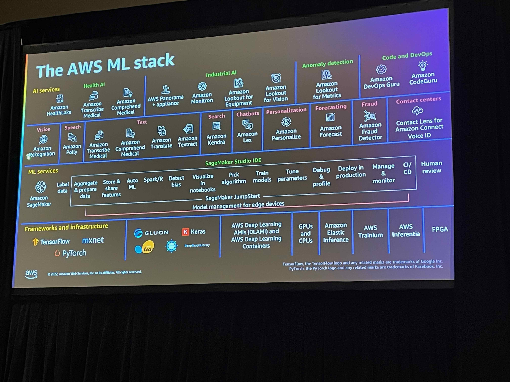
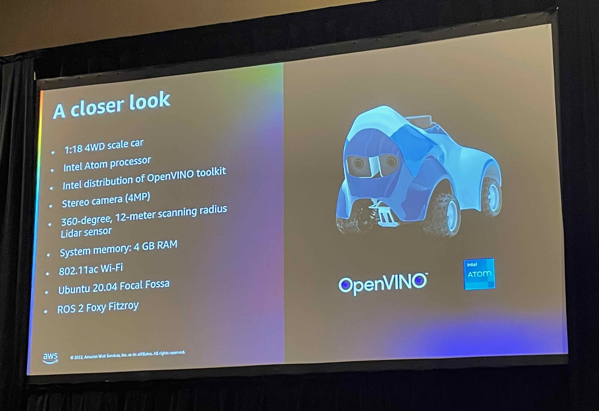

# AWS re:Invent 2022 | Day 2 - Monday, Nov. 28

## Boost your serverless application availability with AIOps on AWS

Mohit Gadkari - Sr.Solutions Architect AWS  
David Ernst - Sr.Specialist Solutions Architect, DevOps AWS

In this workshop the goal was to show how to use AI to analyse Metric anomalies and Reduce noise. ([AIOps](https://docs.aws.amazon.com/prescriptive-guidance/latest/migration-operations-integration/aiops.html))

We Learned how to automate some practices to maintain application availability and reduce the time and effort spent detecting, debugging, and resolving operational issues manually.

AWS provided a workshop studio that allows the use of an open AWS console for the purpose of this workshop following a tutorial to implement the AI in the current architecture to increase the observability of the application.

We implemented some alarms using [Amazon CloudWatch](https://aws.amazon.com/cloudwatch/) specifying a thresholder to trigger an alert.
 
We also learned how to deploy and change some code using [AWS Cloud9](https://aws.amazon.com/cloud9/), a pretty good IDE in the cloud.
 
We had to change the code to create a bug to see the alarm in action, receiving the alert trigger from CloudWatch using AI.
 
CloudWatch also provided a dashboard that we can customize adding any widget that we want to display some metric in a chart to see them in realtime.
 
This was a very good session, and I could understand the power of ClouldWatch.
AWS services used: 
- [AWS Lambda](https://aws.amazon.com/lambda/?nc1=h_ls) 
- [Amazon DynamoDB](https://aws.amazon.com/dynamodb/)
- [Amazon API Gateway](https://aws.amazon.com/api-gateway/)
- [Amazon RDS](https://aws.amazon.com/rds/)
- [Amazon EKS](https://aws.amazon.com/eks/)
- [AWS Cloud9](https://aws.amazon.com/cloud9/)

----

## Serverless stream processing with AWS Lambda, Amazon Kinesis & Kafka

Adam Wagner - Principal Serveless Specialist Solutions Architect AWS 

We dived deep into serverless streaming user cases, one with Apache Kafka and AWS Lambda and another with Amazon Kinesis and Lambda.
 
We learned how to address reliability, scalability, and cost considerations when designing serverless streaming applications.

The session started with an introduction to stream processing with AWS Lambda and two user cases were chosen to demonstrate that:

Connected vehicle data

Real-time fraud detection

 
Kinesis collect, process, and analyze real-time, streaming data and Lambda catches those events to save them later to DynamoDB or Amazon S3. The SNS is just for notification of the issues.
 
This architecture seems very simple, but when they started to talk more deeply about the problems that can occur when collecting a lot of stream data, I realized that it is more complex than I thought.

We need to think how to scale an application without affecting performance.
 
This was a chat/talk session so there were so many questions to the speaker but he did a very good job of answering them and explaining the best approach.
 
There was time to talk about the benefits of using Amazon Kinesis and Lambda function instead of Kafka and the benefits of applying [Event filtering](https://aws.amazon.com/pt/blogs/compute/filtering-event-sources-for-aws-lambda-functions/) to reduce the traffic and consequently the cost.
 
This was very good session in which to be introducted to stream processing with AWS Lambda and what kind of issues we have to deal with when we are building our architecture.
 
In the OutSystems world, it can be something to build apart from the platform depending on the customer needs. We can use OutSystems to show the date in the reactive or mobile application consuming DynamoDB or Amazon S3.

AWS services used: 
- [Amazon Kinesis](https://aws.amazon.com/kinesis/)
- [AWS Lambda](https://aws.amazon.com/lambda/?nc1=h_ls) 
- [Amazon Managed Streaming for Apache Kafka](https://aws.amazon.com/msk/)  

----
## AWS DeepRacer: Get hands-on with machine learning

Parth Desal - Solutions Architect AWS  
Marco Buss - Solutions Architect

[AWS DeepRacer](https://aws.amazon.com/deepracer/) the fastest way to get rolling with machine learning (ML). A very good
project to explain to developers how easy we can integrate ML in our projects without knowing so much about it. And we can compete! There is an AWS DeepRacer League.

The session started by explaining how AWS abstract the whole technology being in ML into AWS Services so we can just use those services to implement the cool stuff.
The first layer in the image below is the AWS service and the others are all the things that AWS will abstract. Pretty amazing, right?

What kind of car we will work with?

Knowing all the specifications we start to understand how the car can learn to drive on a straight road.

The idea behind this is to provide some rewards to the car. If the car is going in the right direction we will give it some rewards, otherwise, nothing.

In that way the car will start going in the right direction and learn by failing. As soon as the car receives 0 rewards, he starts from the beginning.
 
Anyone can develop his own model and this is the competition.
All we have to do is to develop, in a Lambda function, the best algorithm that we think will make our car faster. After that we just need to train our car for 90 min and see the result.

Architecture behind:

In this workshop we used a simple code. provided by AWS,to see how our car had learned from the model and see it in action.

It was a really enjoyable workshop. We could see just how easy it is to apply some ML using AWS Services.
 

----
## AWS re:Invent Expo

Back at the Venetian, it was time to explore the Expo. I’ve never been in an expo so big as that before!

There were a lot of stands including a basketball field :D
 
A lot of big companies were there, such as AMD, RIOT, Deloitte, etc. But the most special was there too!

Around there, I found a special guy.

----

