# AWS re:Invent 2022 | Day 3 - Tuesday, Nov. 29

## Breakfast at CaeserForum

First time here and another big room.. a little bit small compared to MGM grand but still big...

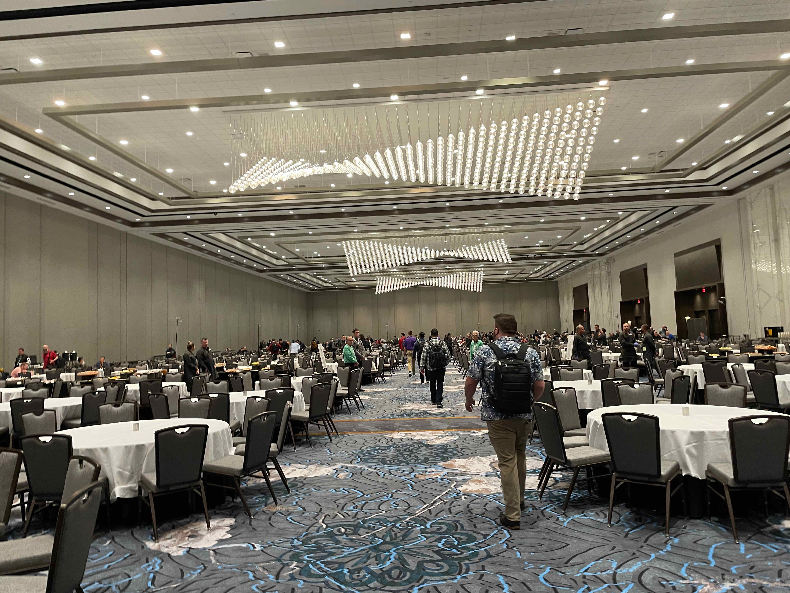

----

## AWS Jam: Security

Matt Bretan - Principal Manager - Global Services Security AWS

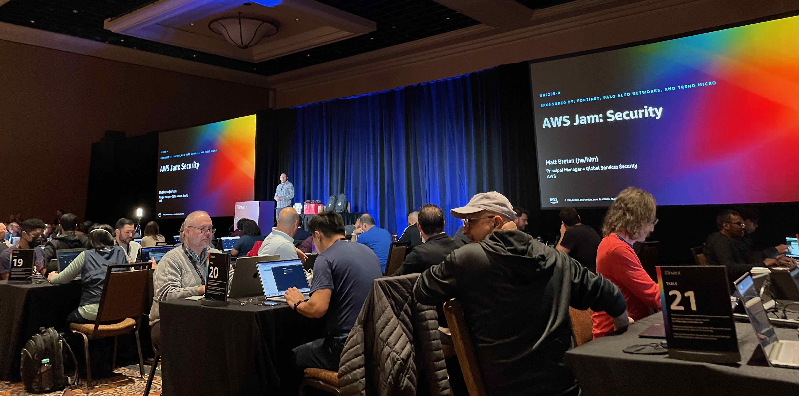

The AWS Security Jam provided incident response scenarios where we could learn new skills solving the incidents.

It was a competition, the faster team finishing all the issues wins!

We were four, two Americans, one English and me :), the Portuguese that has no idea how to fix something on AWS :D, but fortunately I could help because I was the only dev so I could fix some issues related to the applications.

During the fix we were able to use some clues to fix the issues more quickly, of course we lose points doing that, but we were there also to learn so using those clues I could learn a lot about resolving them.

The incidents were on a map and each one had some points.
The Goal was to fix the whole world :D

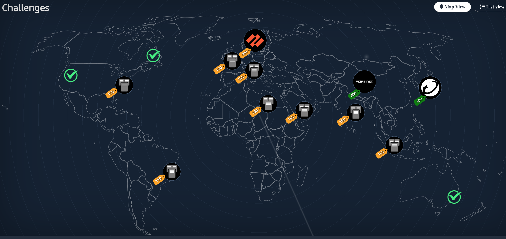

Cool Session fixing issues around all AWS Services.
I fixed most of the time AWS S3 issues around security policies and permissions. The other issues were a little bit harder because we had to get into the firewall or into some infrasture.

Apart from the incidents, it was great to meet those guys.
We talked about what we are doing.
When I started talking about myself they didn't know anything about Outsystems, but they got surprised and one of the Americans said that is interesting and he was looking for something like that for his applications.

----

## Zero Trust security with HashiCorp Vault and AWS (sponsored by HashiCorp)

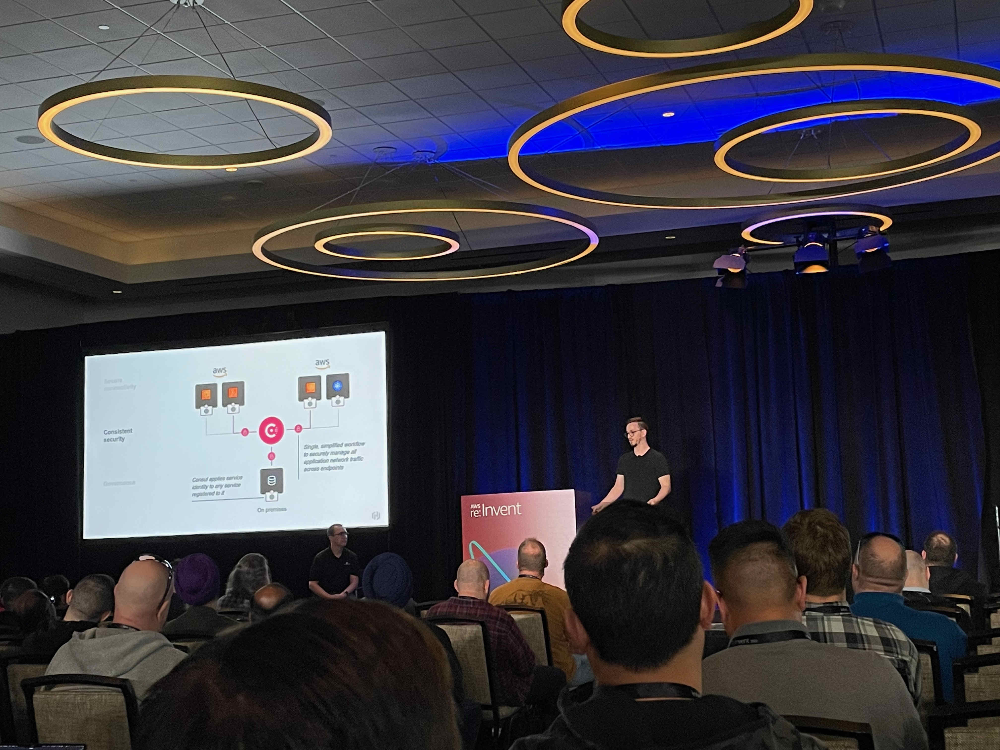

Introduction to [Consul](https://www.consul.io/) and how to become Zero Trust approach using it.

Consul can do pretty things in AWS, facilitate the way to apply security, Service splitter to take care about the traffic, if one of the regions fails they can trigger to another region. It has a good UI that you can easily manage and configure everything that you want on the AWS architecture.

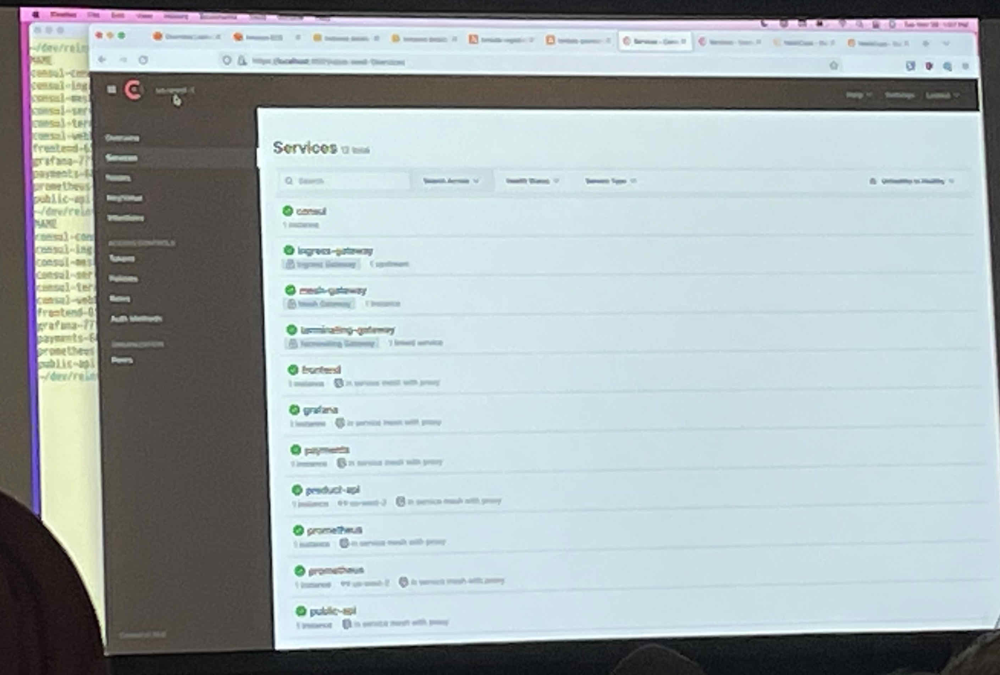

Has been presented a use case from [Comcast's](https://corporate.comcast.com/) that has a big network behind.
To solve some problems regarding responsive multi-Regional failover, routing something to reduce networking complexity they found Consult the best option for that.

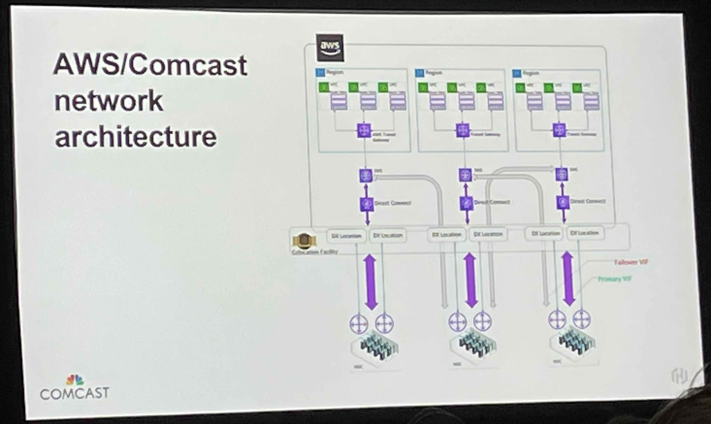

His cybersecurity team is very happy with the benefits of using it as real-time self-service allow/deny for service owners, reducing the pressure on hardware and cloud firewall rules and much more.

Good presentation to understand more some difficulties using AWS services and what Consult can do about it. Good way to make our lives easier without spending so much time developing our configuring the network.

----

## Lunch at MGM

I was shocked when I walked into this meals section.. I was not expecting to be in a place so big just for lunch...

I had an opportunity to have a chat with someone at the table and again soons as I said I'm Portuguese they started talking about Ronaldo... I think nobody cares about our "pastel de nata" anymore :D

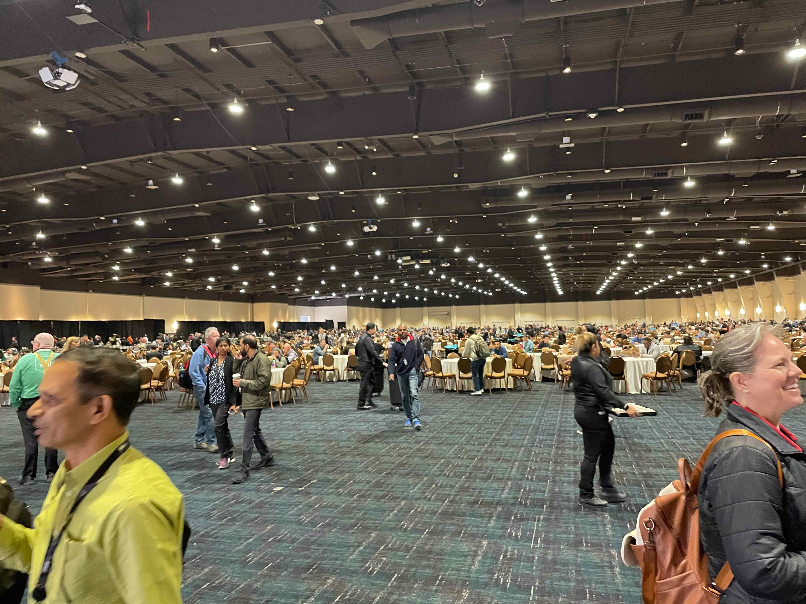

----

## Reinvent how you derive value from your data with Amazon QuickSight

Tracy Daugherty - GM, QuickSight AWS
David Adamson - GM, Head of WWSO AWS
Anusha Hunnangl - Senior Analyst WWSO AWS

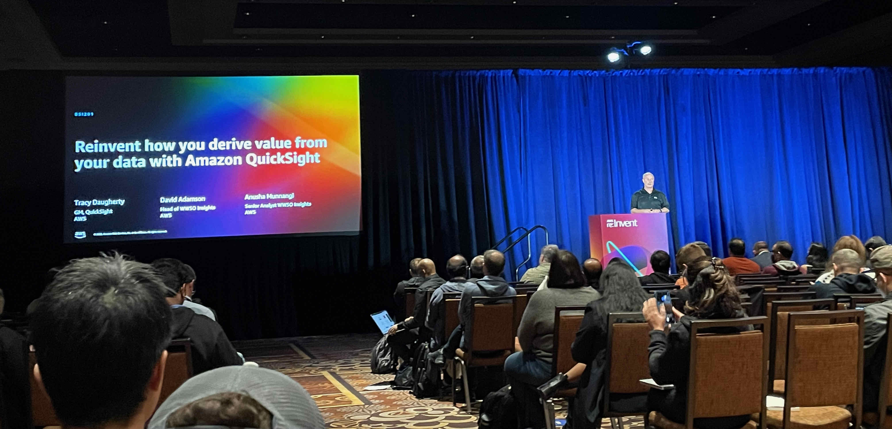

Learned how we can use AWS native business analytics to have machine learning–powered interactive dashboards, natural language query (NLQ), and embedded analytics to provide insights at scale.

BI has been growing along the years and first we just got reports, then we started showing BI to show some data into Dashboards and now we are appling ML into our data to show some conclusion or predict some data.

Not only BI that has changed but the whole way to collect data and now most of the organizations on a big scale are data-driven organizations.

Every user in the organization has his needs and they want to use a lot of metrics on his dashboards and are always looking for more in different departments or needs, so we have to work with different personas to display what is really necessary for them.

But in event-driven organizations there is a lot of data around. To use this data properly we need to have superpowers because we need to be scalable, easy to manage, be able to unite the approaches (Reports, Dashboard, Analytics, ML) and of course reduce costs as much as we can.

So [Amazon QuickSight](https://aws.amazon.com/quicksight/) is an awesome service that resolves those needs faster and cheaper.

To show how powerful it is [WWSO](https://www.amazon.jobs/en/landing_pages/AWS-Worldwide-Specialist-Organization) bring his user case.

Over the years WWSO had to provide a lot of reports and dashboard, soon as they started using Amazon QuickSight the time response is now less than 10 seconds, compared with before that was more than 4 minutes to get a response.

This session was a marketing session, so unfortunately I was not able to see how to manage this tool in AWS Console.. but anyway was too good to understand that QuickSight can a good service to use if we are looking for some BI tool that needs scalable, faster and that use ML behind to provide better metrics.

----

## How Fidelity Investments and Reltio modernized with Amazon DynamoDB

Vladimir Kanavsky - Principal NoSQL GTM Specialist AWS
Dennis Healy - Director of Software Engineering Fidelity Investments
Manish Sood - CEO, Founder & Chairman, Reltio

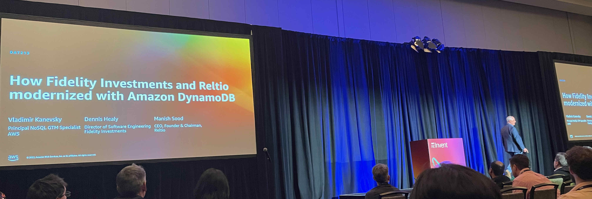

In this session we learned what is [Amazon DynamoDB](https://aws.amazon.com/dynamodb/) that is a non-relational, serverless database solution.

"CIOs say that 80% of developer's time is spent on the operations and maintenance of applications and only 20% of the time is actually spent on innovation"

This is a huge impact on the organizations because if we are not taking time to innovate, we are stuck in trying to maintain our application and we are losing market opportunity for our competition.

All of us, as customers, when we buy something online we want to be fast.
So our applications need to respond quickly and latency as low as possible. It means that relational databases are not possible in big organizations where all the applications are in realtime where scalability is important.

In AWS everything was working with relation Database and it had huge impacts when they wanted to scale up/down because it was not possible.
So Amazon has to find a solution, that's why DynamoDB came up with NoSQL.

To prove that DynamoDB was a success, all Amazon's consumer business migrated 7500 databases and the results were amazing. 40% reduction in latency, 60% reduction in cost and 70% reduction in overhead.

DynamaDB is an awesome service for current/modern architectures.
Modern application architecture are now microservices, decoupled architectures.

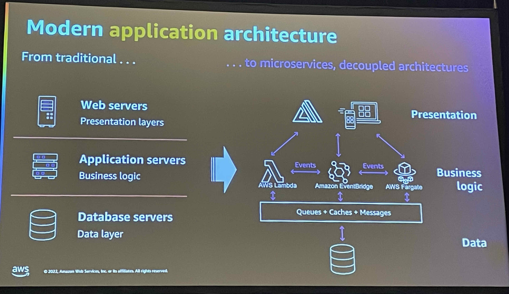

For each Application we now need to think what kind of data is supposed to use and how much latency we should have to understand which architecture we should build.
Using Relational databases for some projects could be enough, but if the application is supposed to grow and work also with multi-region we should use NoSQL.

Has been showed to us two use cases to demonstrate how good is DynamoDB:

[Fidelity](https://www.fidelity.com/) had to move from Mainframe to cloud because they had to work with multi-regions, be multi-availability zone, to keep the latencies low and be able to scale up/down depending on the market conditions.
It was not possible with on-promises using relational databases, so they started using DynamoDB and the results were amazing for the business.

Architecture used:

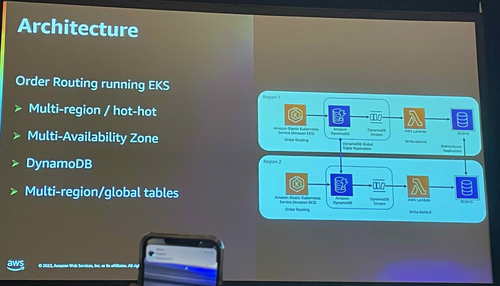

It was funny to hear that before using the cloud, when they had a problem with the system, everyone was stopped on a call to figure out the problem ASAP (PM, DEV, DEVops, ...).
Those calls took hours just to resolve the issue, and there was a lot of pressure to resolve the situation.
When they started using DynamoDB these calls are not so frequent anymore and when they have critical issues it is quick to resolve!

They didn't stop using the Relation Database, they keep working with SQL because some queries are complex and work pretty well in SQL. This shows us that each scenario needs to take into consideration what is better in each case.

Now about [Reltio](https://www.reltio.com/) an example that they were using NoSQL but DynamoDB works better for them.

Reltio is a cloud-native real-time master data management SaaS company, adopted Amazon DynamoDB to meet growth demands for a subset of their microservices, followed by the migration of all relevant workloads from Apache Cassandra.

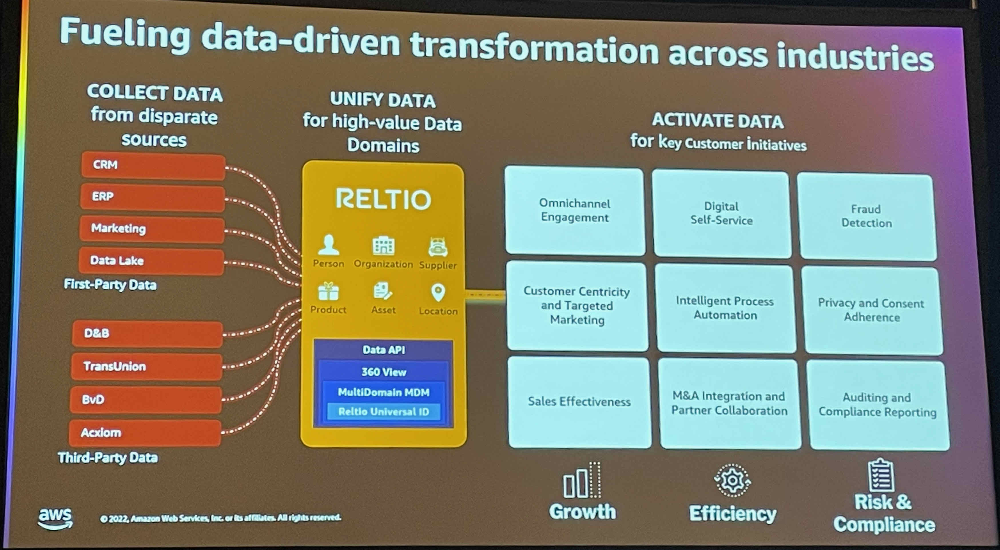

Some examples of brands that use Reltio, and one of our clients is there, "Takeda" :)

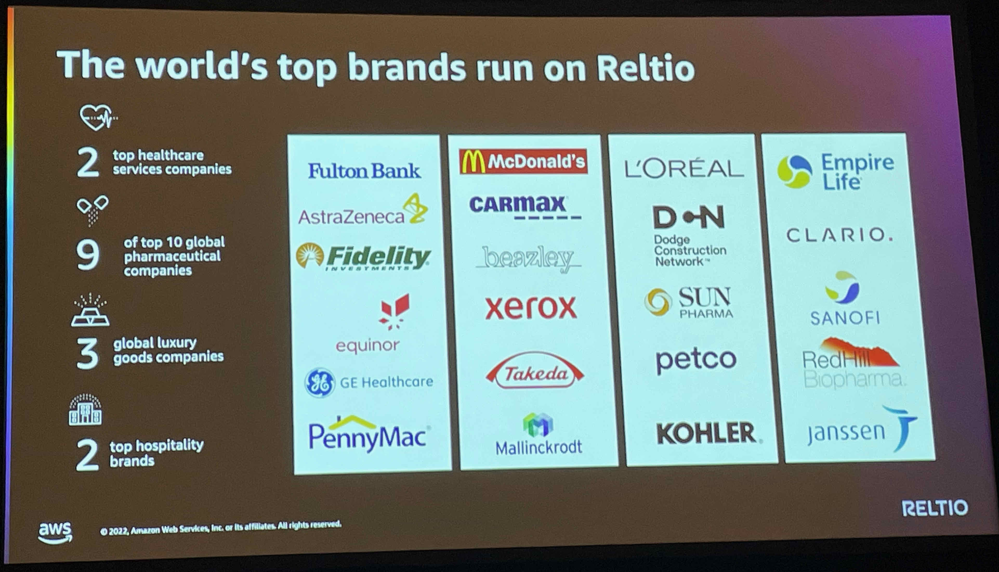

They explained how was important and why they had to move into Amazon DynamoDB, if you want to see more see it [here](https://aws.amazon.com/blogs/database/why-reltio-chose-an-all-in-migration-to-amazon-dynamodb/).

But those are the numbers of this current application.

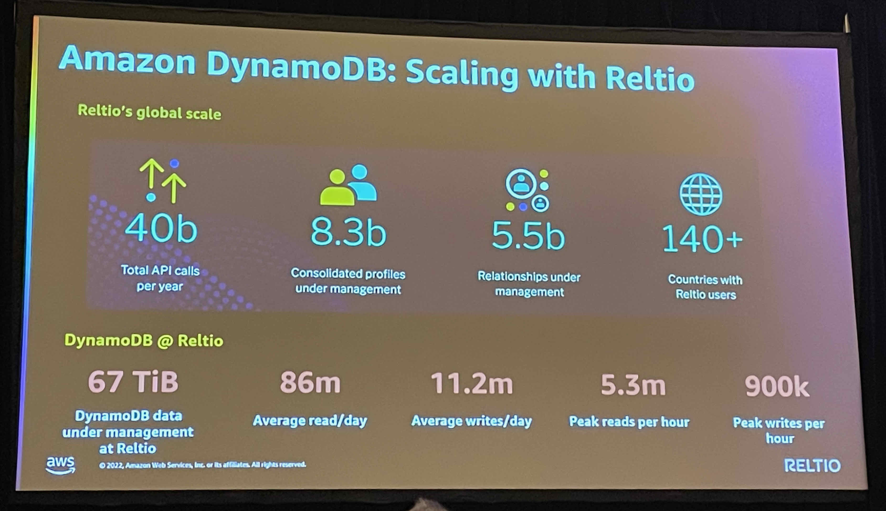

Very nice session to learn more about the power of Amazon dynamoDB

----

## Optimizing price performance with feature management and observability (sponsored by LaunchDarkly)

Charlty Majors - CTO Honeycomb
Brian Rinaldi - Developer Relations Engineer Launchdarkly

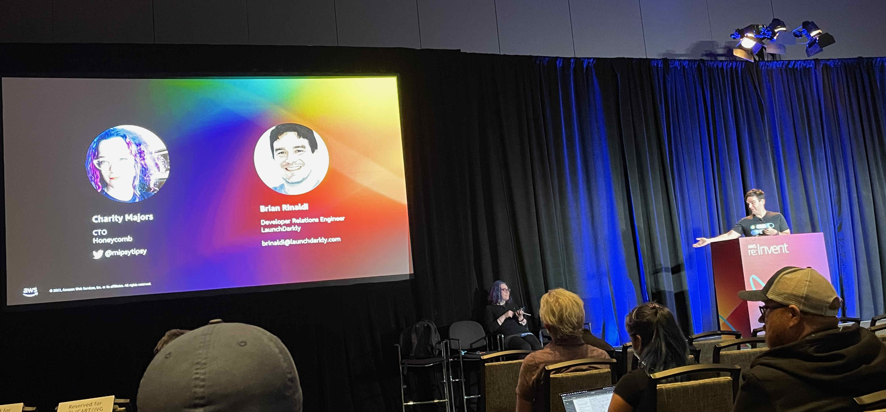

This was the most weird session I ever had in this event...
Launchdarkly explained that Deployment is different from Release and they were explaining that we shouldn't be afraid to deploy code into production.
We can use the power of features flags to be an inactive part of the deployment in production, so that we don't create any impact.

So basically LaunchDarkly does it a lot and manages the deployments using features flags to active/inactive some part of the code.

I could understand what they were saying but.. I was expecting more to be honest, including how they use AWS for that but.. they just talked about features flags :)

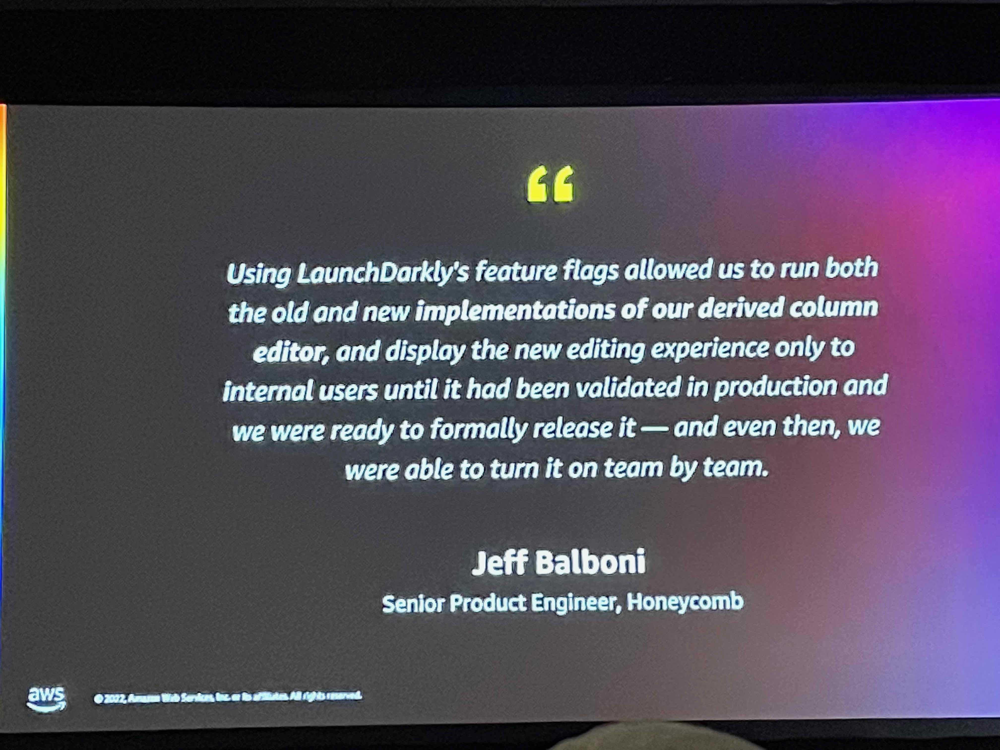

----

## OutSystems Party at Cañonita

What a great way to finish the day. While I was looking for Cañonita I was surprised about a beautiful place in Venetian. They have in the hotel a place that looks like Venice, with a river and boats.

Cañonita was close to the river, so we were having a party beside the river.

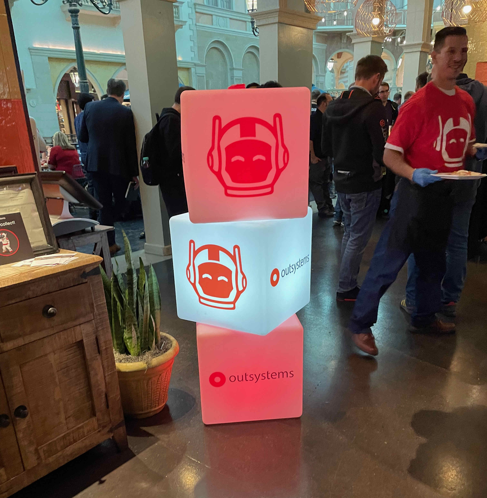

I met Neo again looking around, but unfortunately the people that I met there didn't know about outsystems before, they were just there because of the party :D but it was funny to talk about the technology and AWS eating some nachos and drinking some beers.