# AWS re:Invent 2022 | Day 4 - Wednesday, Nov. 30

## Breakfast at Venetian

Every time that I came to this hotel I always dicovery news things. 

Today I came here for breakfast and I found an eating zone bigger than MGM.
MGM for me was huge but here in Venetian is even bigger! 

----

## Deep learning with Amazon SageMaker, AWS Trainium, and AWS Inferentia

Lakshmi Ramakrishnan - Principal Engineer - Amazon Sagemaker AWS
K.C. Tung - Sr. Solutions Architect - Annapurna Labs ML AWS

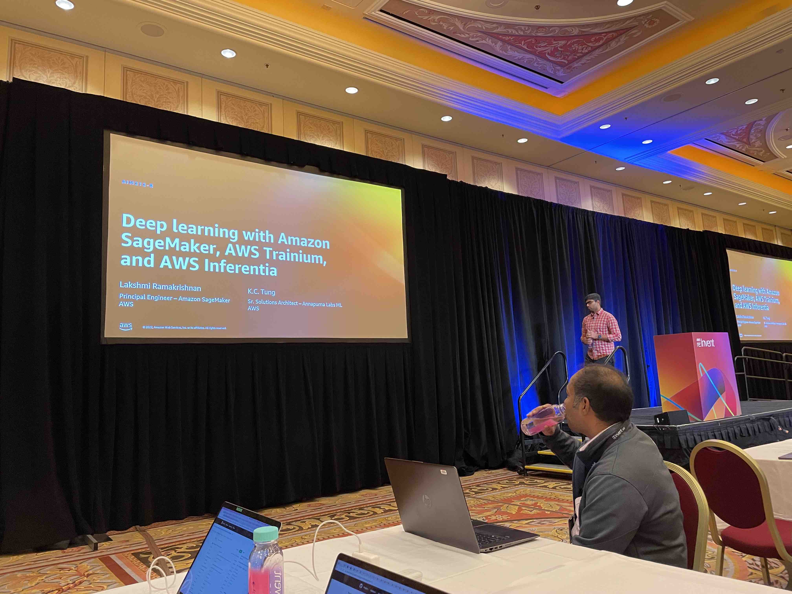

This workshop started by introducing [Amazon SageMaker](https://aws.amazon.com/sagemaker/studio/), a powerful IDE for Machine Learning. We can do everything such as developing, building, training, and deploying our ML models without ever leaving the IDE.

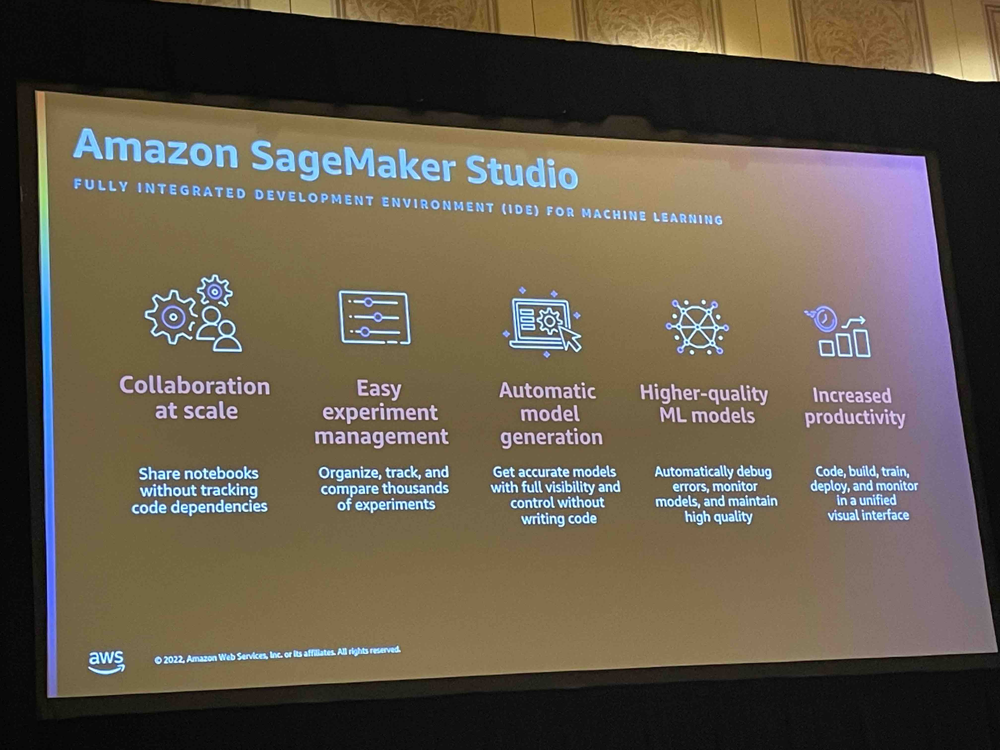

The reason why SageMaker is so powerful is because behind it uses two instances of AWS:
Amazon EC2 Trn1 instances, powered by [AWS Trainium](https://aws.amazon.com/machine-learning/trainium/), and EC2 Inf1 instances, powered by [AWS Inferentia](https://aws.amazon.com/machine-learning/inferentia/).
Trn1 and Inf1 have very good hardware in the cloud for ML purposes.

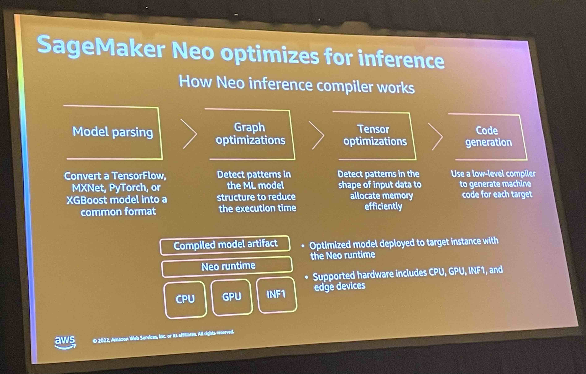

Now that we know what SageMaker is and what it does, it was time to start the workshop.
The goal is when we send a sentence to the endpoint, the model trained, will predict the sentiment of the input sentence using an IMDB dataset with sentences labeled to be either positive or negative sentiment.

We [cloned](https://github.com/aws-samples/sagemaker-trainium-inferentia), a project into sagemaker and we followed the python [script](https://github.com/aws-samples/sagemaker-trainium-inferentia/blob/main/HFbertdemo.ipynb) to show how to train a text classification model with AWS Trainium and then deploy it in AWS Inferentia.

We used a pretrained [BERT model from Hugging Face](https://huggingface.co/bert-base-uncased?text=Paris+is+the+%5BMASK%5D+of+France.) and fine-tune it with IMDB dataset.
The training job will be made on ml.trn1 instance which hosts the AWS Trainium accelerator and then the trained model weights will be deployed in an endpoint in ml.inf1 instance which hosts the AWS Inferentia accelerator.
We have been using Amazon S3 to save a get the ML models.

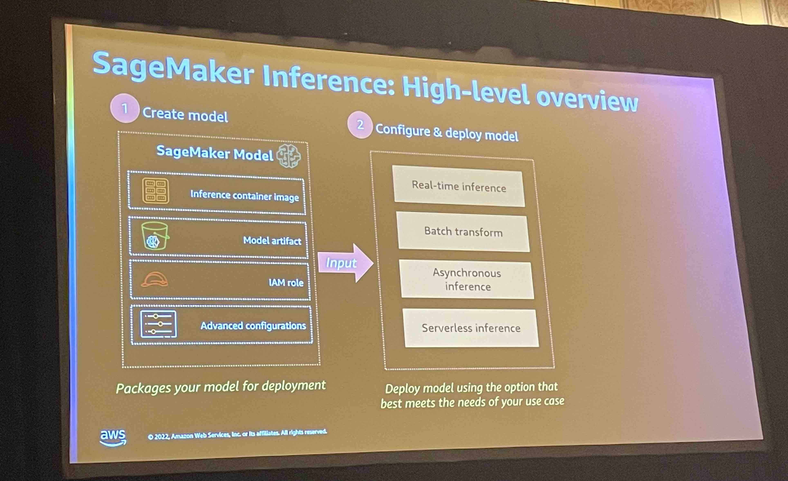
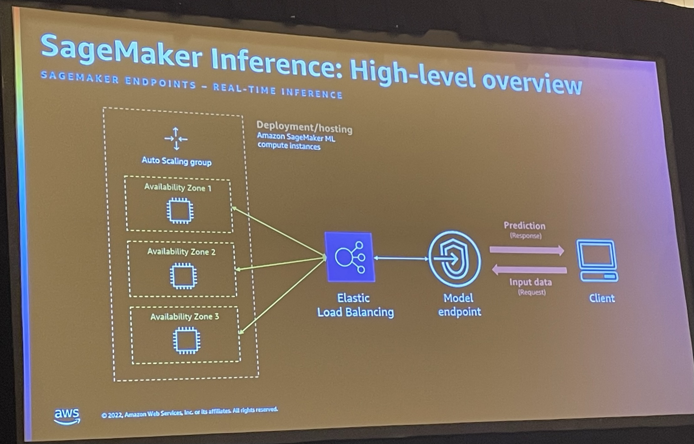

At the end we are able to play a little bit and predict some sentences :)

In this session was also mentioned the evolution of the hardware from Trn1 and Inf1.
Trn1 instances can save up to 50 percent in training costs and Inf1 for up to 2.3x higher throughput and up to 70 percent lower cost per inference over equivalent GPU-based EC2 instances.

A really nice workshop to get my hands back on ML but this time using SageMaker.For this example we could see how fast the training and the deployment were, and start using the ML model to predict my sentences :)

----

## Kubernetes and cloud-native data management with Kasten by Veeam (sponsored by Veeam)

Michael Cade - Senior Technologist Kasten by Veeam
Deepika Dixit - Member Technical Staff Kasten by Veeam

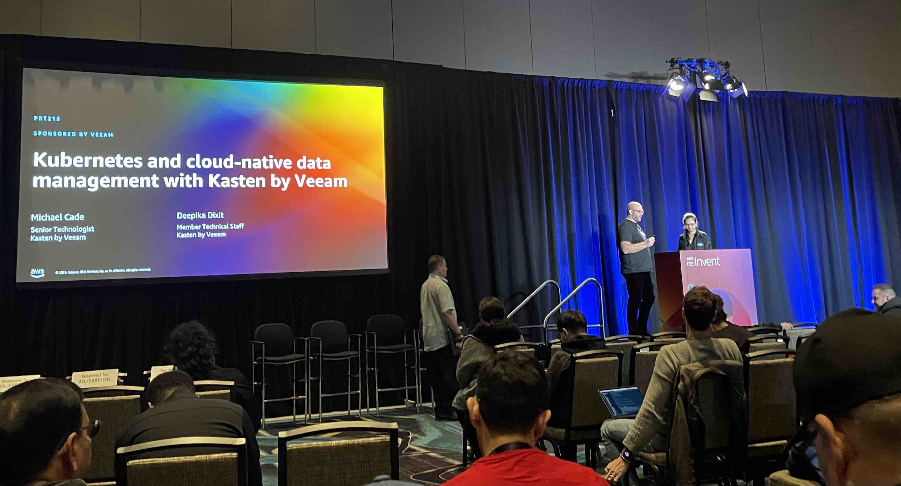

The target of this session was for Operation People but was fun to learn a little bit about the infrastructure using [Kasten K10](https://www.kasten.io/) on [Kubernetes](https://kubernetes.io/).

Kasten K10 is in the AWS marketplace and enables seamless backup and disaster recovery on [Amazon EKS](https://aws.amazon.com/eks/), [EKS Distro](https://aws.amazon.com/eks/eks-distro/), and Kubernetes distributions such as Red Hat OpenShift on AWS (ROSA).

They showed how to deploy the application using kubernetes and [Helm chart](https://helm.sh/) to manage the secrets encrypted in AWS.

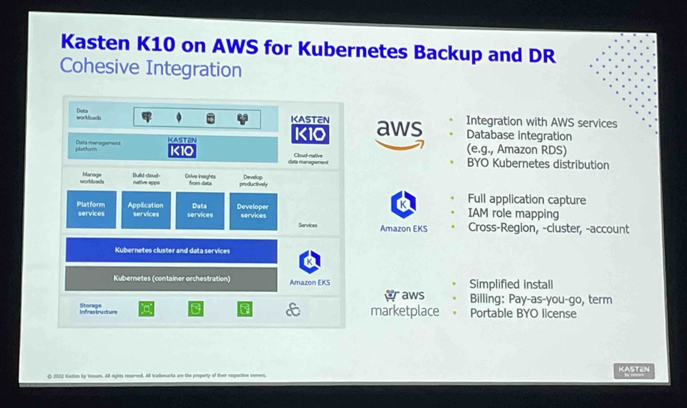

Kasten also has a pretty good UI that displays all the information that we need including the scalability with multi-cluster dashboards.

They also showed the workload migration and database integrations providing insights into cloud-native data protection using AWS Identity and Access Management (IAM) and Object Lock in Amazon S3.

If we are using kubernetes it can be a good tool!

----

## Developers do care about security: Building a more collaborative path (sponsored by [Trend Micro](https://www.trendmicro.com/en_us/business.html))

Madeline Van Der Paelt - Development Manager

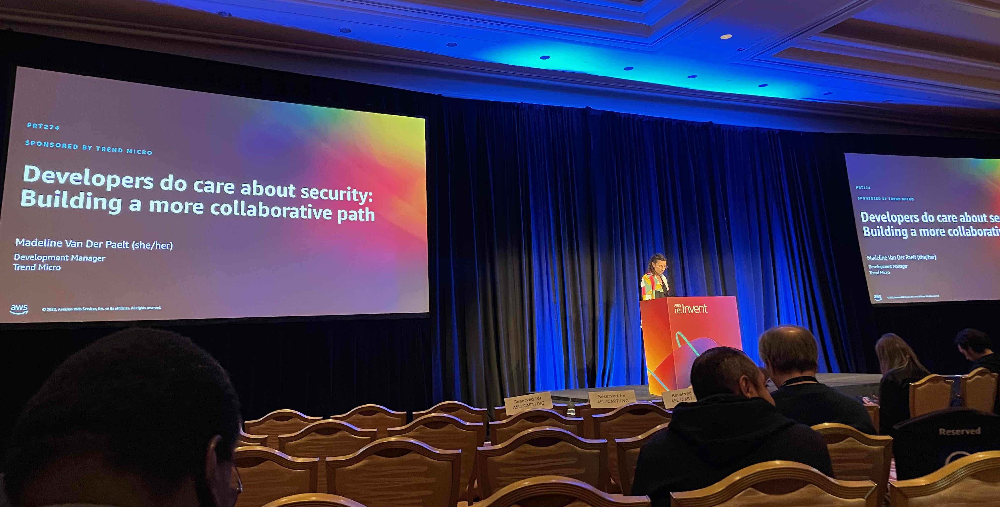

The session started to explain that it can be challenging and time-consuming to deliver a modern application that meets security and compliance requirements.

Developers may be invested in security but many don’t have the knowledge or capacity to be experts. It is because a developer needs to worry about a lot of stuff when developing.

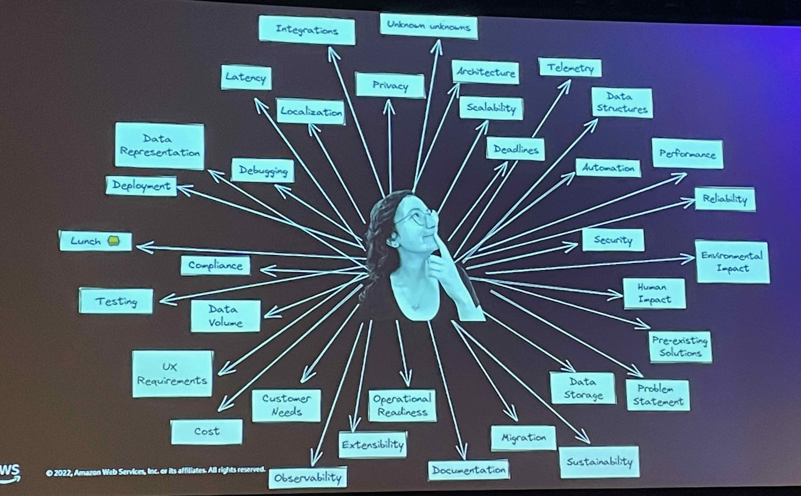

Security most of the time is not taken in consideration as it should be.
But as Developer we should only worry about customer requirenents and not everthing.

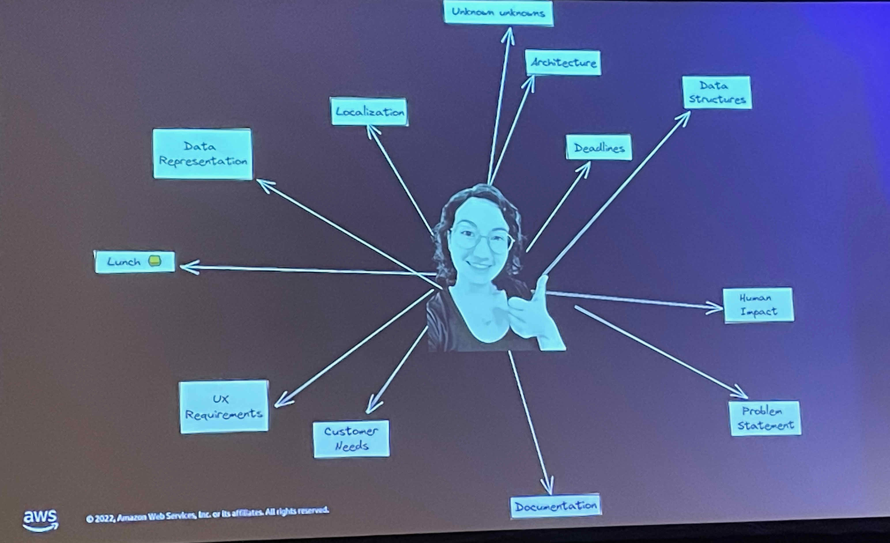

So in this session, we learned how the developers and security teams at Trend Micro work together to meet security requirements while building a better design pattern to meet the needs of both teams. 

One of the ways is on pre-deployment. At this stage we are building the solution and the whole team needs to know the application and the customers needs. 
It means the security team should also know about it to work together on the customer needs. They quickly can identify where the application can be vulnerable and also which kind of tools the team should use.

The team should analyze the work and think together how automate the processes, for example applying security in the pipelines.

The other way is on post-deployment. At this stage we should know that in Production everything is Ok. For that many while are developing are also doing Operations, Monitoring, QA, ... work and it's a lot.

So Madeline mentioned what kind of Aws Services they use to reduce the developers effort.

[AWS well-Architected Tool](https://aws.amazon.com/well-architected-tool/) to apply best practices (similar to AI Mentor Studio in Outsystems) and more.

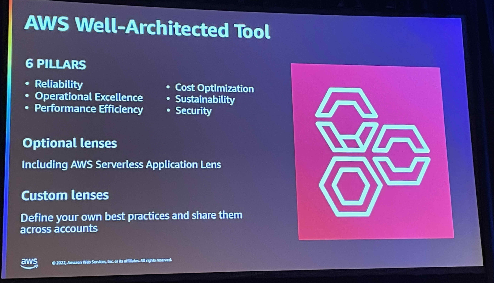

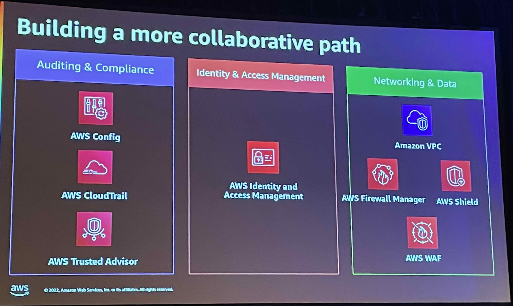

So those are the AWS services that the whole Team uses to optimize their work and to be more collaborative.

A very nice session to know which tools an organization can use when we are using AWS services in the projects. The best way to grow is to have all the team involved to improve processes and the quality of the applications. If all the teams use the same same tools, it means everyone is on the same page.

[See all here!](https://youtu.be/TcU4lsypyug)

----

## Learn how Black Knight is using AI to accelerate mortgage workflows

Aditya Krishnan - General Manager, AWS Machine Learning, Computer Vision AI - Amazon Web Services
Frank Poiesz - Business Strategy Director, Origination Technology - Black Knight

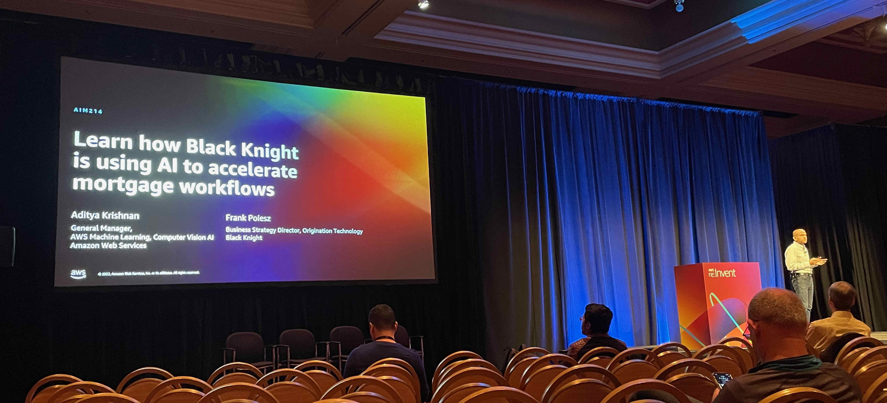

This session started to explain that nowadays we still use a lot of paper that still powers all sorts of businesses.

Currently there are three main approaches to process all of those documents by using Optical Character Recognition (OCR) but unfortunately work better with simple documents and can't get all the words in the document, manual processing via human review that don't scale easily with document volume and finally using rules and templates to deal with the bag of words that have been extracted, the human has to figure out exactly what template should use and when new kind of document shows up, new templates needs to be created.
Those kinds of ways are expensive, extremely slow to process all the data and are limited to grow.

So AWS has [Amazon Textract](https://aws.amazon.com/textract/) a machine learning (ML) service. It automatically extracts text, handwriting, and data from scanned documents beyond simple optical character recognition (OCR) to identify, understand, and extract data from forms and tables.

AWS also invented Amazon Textract Queries which enables the users to specify, using natural language queries, and extract pieces of information from the documents.

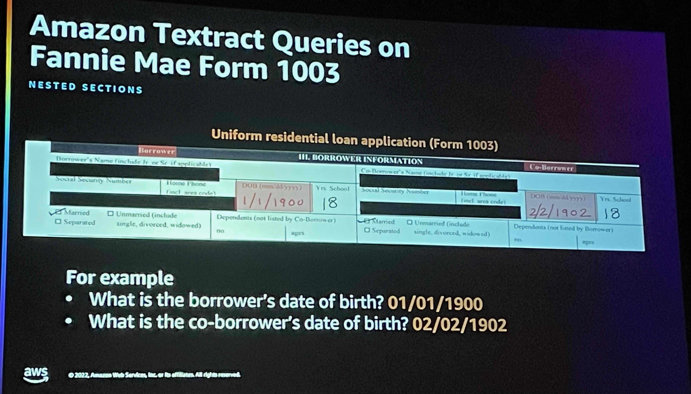
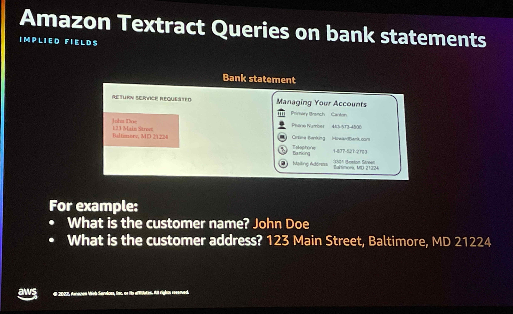
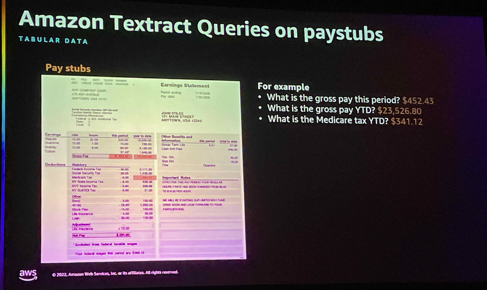

This is already great but AWS recently launched the [Analyzed Lending API](https://aws.amazon.com/about-aws/whats-new/2022/11/amazon-textract-analyze-lending-accelerate-loan-document-processing/) to help the users to automate mortgage document processing to drive business efficiency, reduce costs, and scale quickly.

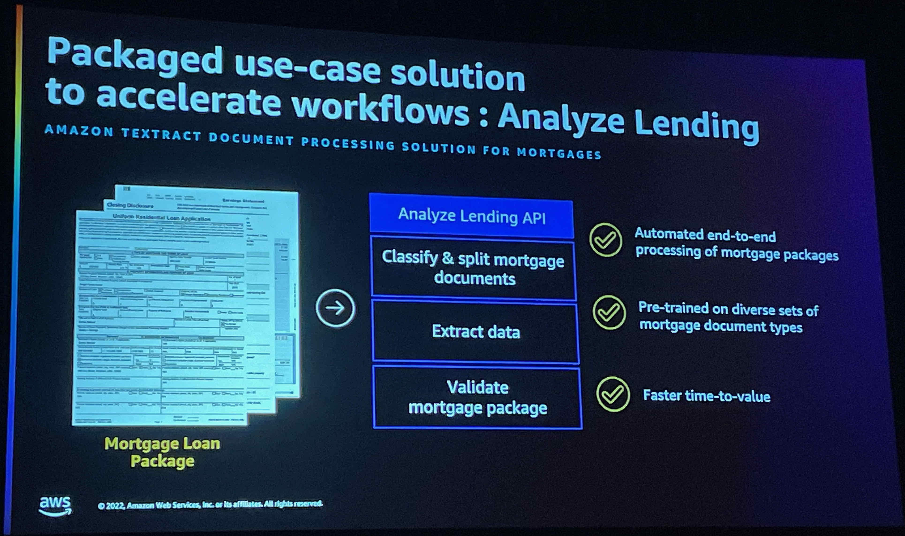

After learning the power of Amazon Textract was time to explore how Black Knight, a premier mortgage analytics company, is adopting AWS artificial intelligence (AI) services for its data and domains to process documents at scale.

We learned how they use Amazon Textract to reduce manual processes, mitigate regulatory risks, and deliver significant cost savings to their clients, including many of the largest US lenders.

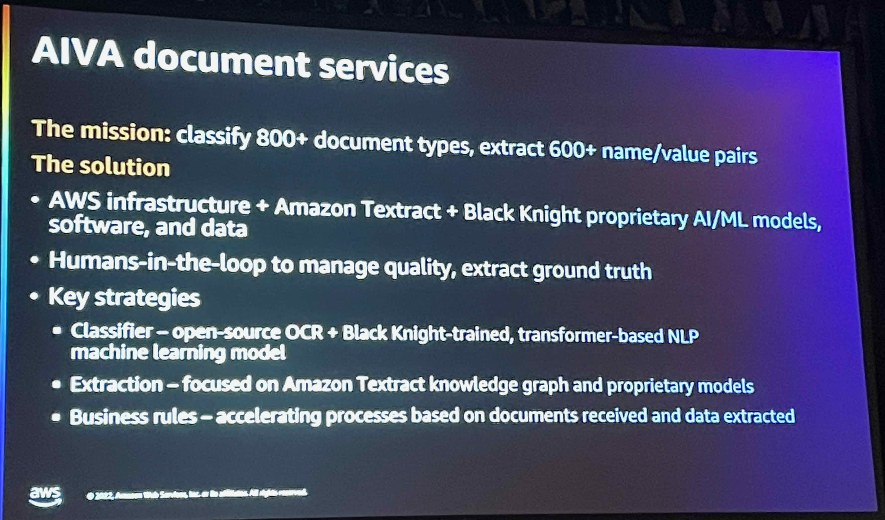

Black Knight uses AWS AI services to help clients improve and scale their business processes with automation and a complete solutions ecosystem that supports the entire real estate and mortgage lifecycle.

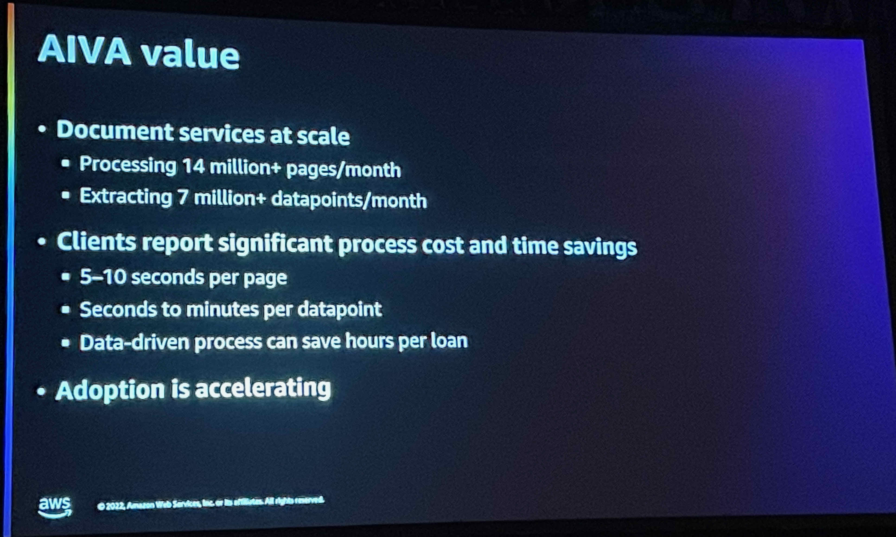

I really enjoyed this session. On my previous project, we built a real estate app to manage all of the mortgages, and we knew that using OCR technology to read the documents would improve all the processes. But we also knew that this technology is not perfect and it could cause a lot of issues if it wasn't able to extract the data from the documents, for that reason they kept using manual actions.

Now I know that using Amazon Textract can be a good option if our customer needs to process a lot of documents into their application.

[See all here!](https://youtu.be/OEJ24XGMbEI)

----

## The architect elevator: Connecting the boardroom and IT

We upgrade our technology all the time—isn’t it time to update the role of architects? Today’s successful leaders forge a tight connection between an organization’s strategy, its technology choices, and its operational capabilities. The IT engine room, although equipped with amazing capabilities, can be daunting. That’s why modern architects add value by connecting IT and the boardroom by building executive awareness, clearly communicating technical trade-offs, and facilitating better decision-making. This session redefines the role of the architect for the modern enterprise and teaches technology leaders and architects how they can form a fruitful alliance across the levels of their organization.

[See all here!](https://youtu.be/goYiaIGebFo)

----