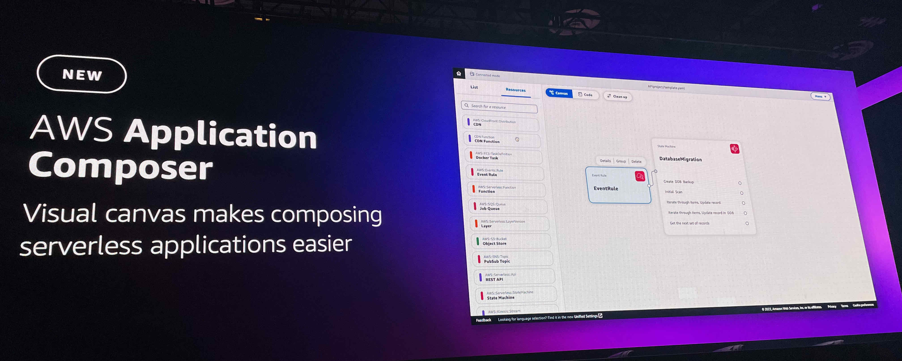

# AWS re:Invent 2022 | Day 5 - Thursday, Dec. 1

## Dr. Werner Vogels Keynote

Great Keynote from Join Dr. Werner Vogels, Amazon.com VP and CTO.

He introduced new services including [AWS Application Composer](https://aws.amazon.com/application-composer/)that simplify and accelerate architecting, configuring, and building serverless applications. 

We can drag, drop, and connect AWS services into an application architecture by using AWS Application Composer’s browser-based visual canvas. Looks like low-code for AWS services!!

It's definitely a keynote to watch!

[See all here!](https://youtu.be/RfvL_423a-I?list=PL2yQDdvlhXf8xcKr0-BHEyg_8VB4tWdu1)

----

## Build a complete DevSecOps pipeline on AWS

George Rolston - Senior Solutions Architecture - Cloud Foundations AWS
Brian Terry - Senior PSA-ISV Integrations - CloudFormation AWS

In this workshop we learned how to build a DevSecOps CI/CD pipeline with security and compliance testing integrated into the development process. 

We used GitHub Actions to integrate [AWS CloudFormation Guard (cfn-guard)](https://docs.aws.amazon.com/cfn-guard/latest/ug/what-is-guard.html) to run policy validations and ensure that pipeline deployments are consistent and that they meet organization's compliance standards. More AWS for GitHub Actions can been found [here](https://github.com/aws-actions).

For the workshop, we followed a tutorial to create the three stages (build, compliance and deploy) for the pipeline in this Architecture.

 The result can be found [here](https://github.com/TiagoCoitoDIL/CompliantePipeline/tree/feat-init).

----

## Preserving and maximizing the value of digital media assets using Amazon S3

In this sessions we talk about 3 main points using S3 bucket

1 - Managing exponential growth
The data is all around us even in our pocket taking photo, Stream services and image how the content is beeing generated 

There are a mass of amount of data that we are alwauts using.
101zb of data created and replicated in the world in 2022.

There is a lot of data to store and we are alwats try to think how we should store them.

There are a lot of data, and most of the data is cold.. Mean we don't using so often. 

Many users com to s3 to manage their data.
Amazon s3 archival storage classes. -> ver imagem

Thre pupose glacier

S3 glacier instant retrieval - retrieve data that we are not using to often

S3 Glacier Flexible Retrieval - flexiblilty, 

S3 Glacier Deep Archive - truly cold data

2 - Preserving your most princeless assets

- Preserving, and sage the data

mostrar a image

S3 performs over 4 billion checksum computations per second, 

3 - Maximizing the value of archival data

1 PB restored every day from S3 Glacier

unlocking the potentail of your data

We have the opportunity to ear some example this use

->Warner Bros. Discovery https://wbd.com/

They start to digitization fisical films to be durable a long the years.

They innovate has they should store, but have to use AWS

thaking advantages of data the that has been perserved

-> CNN

-> PGA Tour https://www.pgatour.com/

[See all here!](https://youtu.be/8OI0Uu-YvD8)

----

## Accelerate high-performance workloads with Amazon File Cache

Darryl Osborne - Principal Solutions Architect, File Storage AWS
Mark Roper - Principal Software Engineer, Amazon File Cache AWS

This chalk talk started by introducing the [Amazon File Cache](https://aws.amazon.com/filecache/).

This service provides a high-speed cache on AWS to makes it easier to process file data, regardless of where the data is stored. 
It serves as a temporary, high-performance storage location for data that's stored in on-premises file systems, AWS file systems, and Amazon Simple Storage Service (Amazon S3) buckets.

To explain the purpose of this service they show us an example.

A compute cluster on AWS needs to access data locally for some workload, so typically compute on AWS will mount directly on local storage, but it creates some challenges because it has high latency and low network bandwidth. Whenever we want to access it will be slow.

What we could do is a bulk copy of on-premises data to AWS.
The problem is that in some cases it can be complicated and complex to move large amounts of data with a larger dataset and files in a complex directory structure, and of course it takes time to move everything to AWS.

So the solution is to Amazon File Cache, we will have a cache that automatically imports and temporarily stores data that's being used by the compute jobs on AWS.
When the data is in the cache the AWS compute cluster has access to that data at some millisecond latencies and up to hundreds of GB/s of throughput. 

Using File Cache connected to S3, it will act as a cache in front of S3 to have a high speed file system interface to process S3 datasets.

Because it was a chalk talk, there were so many questions regarding other kind of solutions for this example, using other services but the conclusion was everything depends of the customer needs and costs as a short or long term and Amazon File Cache is just a service that you can use.

This is an amazing service from AWS.
In many projects we may need to access to data on-premises and probably our first approach is to move everything to AWS S3 to reduce the time accessing to the files, but sometimes we don't need to move all the data for what we want to process, so using AWS file caching can be a good solution when we want to access on-premises data for a specific workload.

----

## re:Play party

What a party!! I felt like I was in a festival, so many people were around there!
We could understand the dimension of the event being in the party.

We were around 50 000 attendees for this conference, I am not sure if everybody was there but for sure we were so many.

The place was huge with two stages, one for DJs and one for live bands.
Two places to eat and interactive activities like dodgeball, Button Mash 4.0, archery tag and an entire area for Riot Games.

In the main stage we had a pleasure to have Martin Garrix playing for us.

As I said, it was a festival and was amazing!! I enjoyed it a lot!!

----