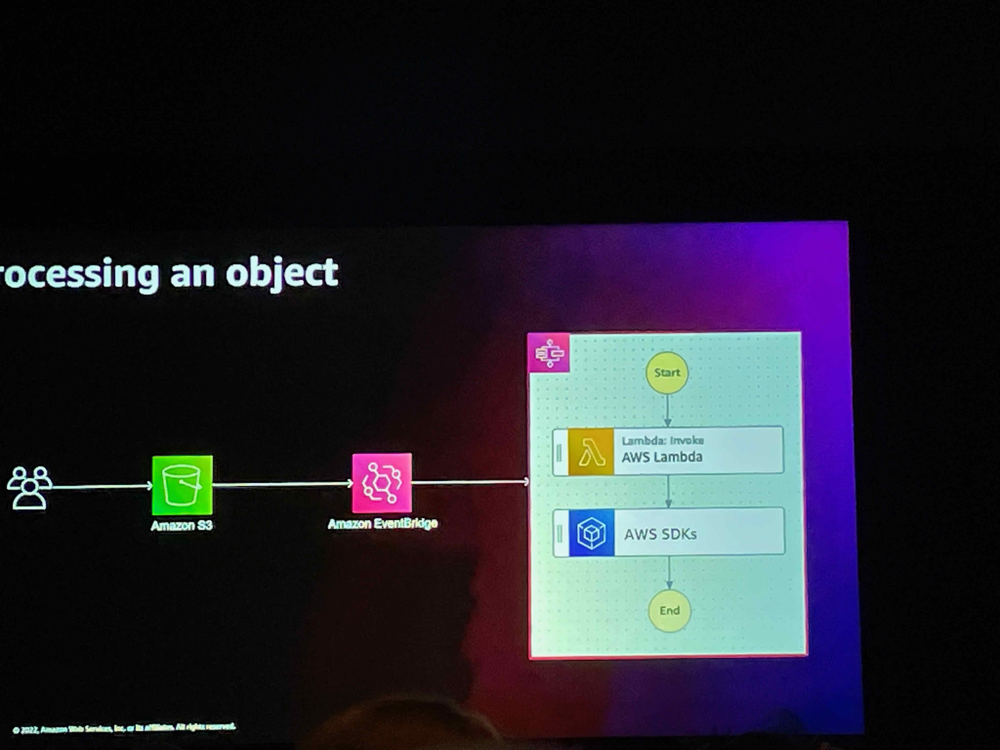

# AWS re:Invent 2022 | Day 6 - Friday, Dec. 2

## Breakfast

After the long night at the party yesterday, I woke up early to eat my breakfast at CaeserForum while I was trying to reserve my seat in some of the last sessions.

The sessions that I marked as favorite were full so I was looking around in the meeting rooms to see if one of them I was able to join.

Luckily I found a new session about a new announcement from AWS.

## Accelerating workloads using parallelism with AWS Step Functions & Lambda

Brian Zambrano - Serveless Specialist - Solutions Architect AWS

Justin Callison - General Manager - AWS Step Functions AWS

Adam Wagner - Principal Serveless Specialist - Solutions Architect AWS

In this session, we learned how to leverage AWS Step Functions and AWS Lambda to achieve cloud-scale parallelism for our workloads using the new feature distributed map.

The session started by a quick talk about evolution of data processing and then an overview about [Step Functions](https://docs.aws.amazon.com/step-functions/latest/dg/welcome.html) that is a serveless workflow service used across a variety of use cases as data processing, application Orchestration, security and IT automation and Machine Learning using more than 220 AWS services and 10 000 APIs actions.

In the image below we can see how Step Functions works and how quickly and easily we can build our step functions using the workflow studio with a simple drag and drop.

Let's say that Step Functions are our BPT's in Outsystems.

To explain how Step Functions work in parallel, they started to explain how to process an object first following a very popular use case, a person creating an object in S3.

It's event driven, the object landing in S3 creates an event which is sent to EventBridge with a rule that routes to Step Functions.
Step Functions can do a variety of things. It can have a Lambda Function to process it and use one of the SDK Integrations. If we wanna add another application, maybe another step function, we add a rule in the EventBridge using the same event will trigger the two step functions.

If we have a whole bunch of existing objects in S3 and we want a way to process them. AWS has the inline map state that enables dynamic parallelism, executing the same workflow steps for a collection of items achieving parallel processing without the complexity of thinking about multi-threading or using some sort of parallel library.

The problem is that it is limited to 25 000 steps, just supports up to 40 concurrent iterations and the input and output must be under 256 kb.

Now with the new distributed map we don't have this limitation.

This new map state, with distributed map, the individual iterations within the distributed map are now child workflow executions.

It will list all the objects from a S3 bucket generating a giant list of objects, and will pass those object keys to these child workflow executions that will run in parallel, as soon as they are done the result will go into S3.

After this explanation about Step Functions Distributed Map, they showed us a demo, step by step, of how to build a step function Distributed Map with the exercise of finding the highest average temperature by month, from 32 gb of csv files in S3 from 1929 until today.

Each csv has a stationID attribute that we will use as key and in the middle of the other attributes we have one that is temperature, that is the average temperature for the station for a given day. (In [here](https://aws.amazon.com/pt/blogs/aws/step-functions-distributed-map-a-serverless-solution-for-large-scale-parallel-data-processing/) you we have another tutorial how to build a Step Functions Distributed Map.)

After the demo they went deeper in Distributed Map covering five concepts: input sourcing, concurrency management, batching, failure handling and results management.

Parallel processing is a common computing approach to help solve large problems in a shorter period of time. By running the components of a problem concurrently, the total duration is greatly reduced. When they are processed in parallel, the same task takes only one minute.

Another great session! I think this is another powerful feature of AWS. I was thinking if I had to build this in Outsystems it would take a long time to process all the files and still do the final calculation.
This is a good example for a use case where we can use AWS Service to reduce process time in our OutSystems application.

[See all here!](https://youtu.be/SG6_oy72hh4)

----

## Last Day

What an amazing event! This was a really great experience! 
I had never been in an event so big and very well organized.

I learned a lot during this week, I met a lot of people and I have been in Vegas!!

Thanks Do it Lean for this opportunity, is something that I will never forget!

We can watch some of the breakout sessions and keynotes from the event in [AWS youtube channel](https://www.youtube.com/@AWSEventsChannel). 

